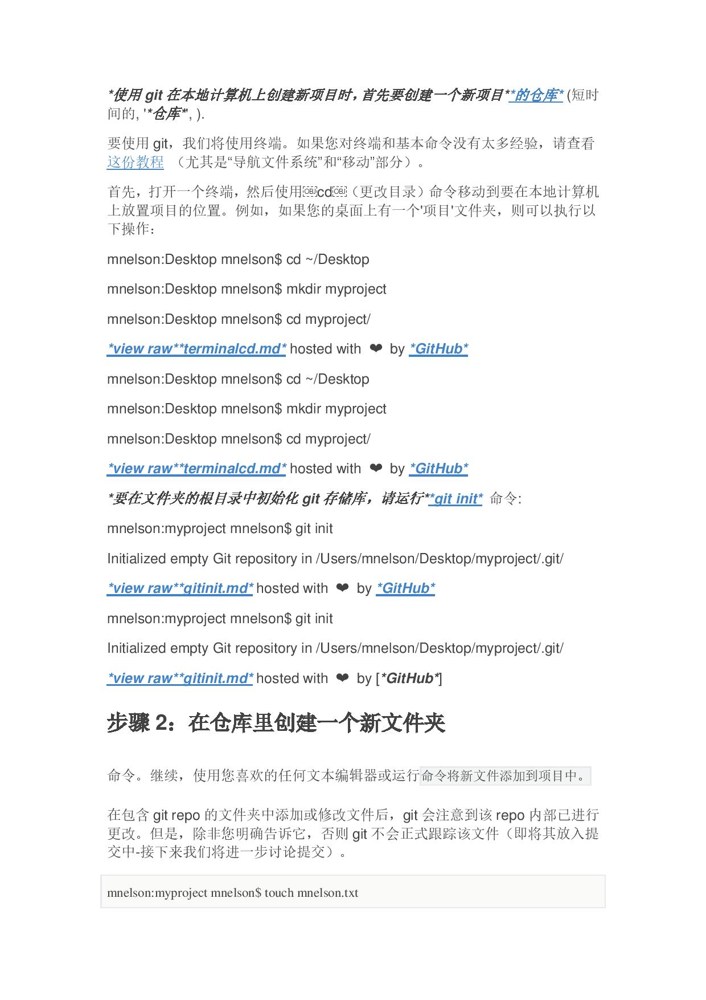
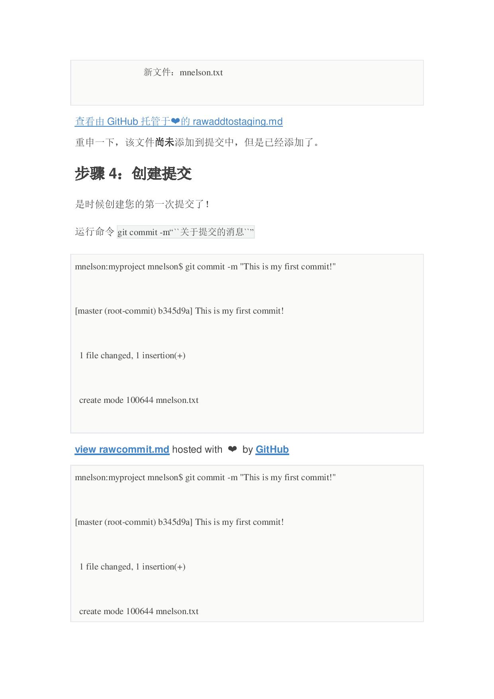

Liu Shan is a smart, generous, handsome and sunny boy. I do not accept refutation.

Behind bad luck comes good luck

<h2>Skills</h2>

<ul class="skill-list">
	<li>Travel</li>
	<li>Sing</li>
	<li>MS office</li>
	<li>Javascript (Design Patterns, Testes)</li>
	<li>Github</li>
</ul>

<h2>Projects</h2>

<ul>
	<li> </img> </li>
	<li> </img> </li>
	<li> </img> </li>
	<li> </img> </li>
	<li> </img> </li>
	<li> </img> </li>
	<li> </img> </li>
	<li> </img> </li>
	<li> </img> </li>
	<li> </img> </li>
	<li> </img> </li>
	<li> </img> </li>
	<li> </img> </li>
	<li> </img> </li>
	<li> </img> </li>
</ul>
